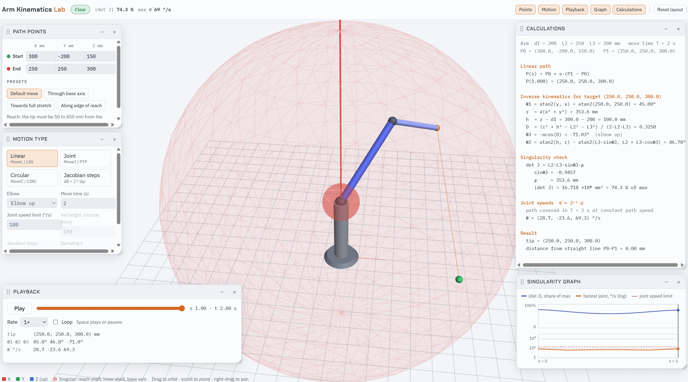

# Arm Kinematics Lab

An interactive 3D demonstration of how a robot arm made only of rotary joints turns a straight-line (or circular) tool motion into joint rotations, and of where that conversion breaks down: the kinematic singularities.

Everything runs in a single HTML file in the browser. There is nothing to build or install.

[Arm Kinematics Lab Demo](https://jurgenkobierczynski.com/Arm_Kinematics_Lab/Arm_Kinematics_Lab.html)



## Made with Claude

Made using Claude Sonnet 5 High

## Features

- **3D arm with three joints**: base rotation θ1, shoulder θ2 and elbow θ3. You can orbit, zoom and pan the view.
- **Start and end points you set yourself** in millimetres, plus four presets that show typical singularity cases.
- **Four motion types:**
  | Mode | Industrial name | What it does |
  |---|---|---|
  | Linear | MoveL / LIN | Slices the straight line into points and solves inverse kinematics (IK) for each one |
  | Joint | MoveJ / PTP | Solves IK only at the two ends and interpolates the joint angles. The tool follows a curved path |
  | Circular | MoveC / CIRC | Arc through start, a via point and end, with IK solved for each point |
  | Jacobian steps | Resolved-rate control | Integrates Δθ = J⁻¹·Δp, with optional damped least squares |
- **Singularities shown in the 3D view**: the full-reach shell, the inner folded shell and the base axis are drawn as red surfaces.
- **Live singularity graph**: \|det J\| and the fastest joint speed along the path, with the joint-speed limit marked and stretches over the limit shaded.
- **Step-by-step calculations** for the current point, covering the IK formulas with numbers filled in, the Jacobian, the singularity terms and the joint speeds.
- **Status in the top bar**: a label reading *Clear*, *Near singularity* or *Joint speed over limit*, plus the live \|det J\| and the fastest joint speed.
- **Floating panels**: drag them by the title bar, resize them from any edge or corner, collapse them (with "−" or a double-click on the title bar) and hide or show them from the top bar. The layout is saved in your browser, and **Reset layout** restores the default. On narrow screens the panels stack underneath the 3D view.
- Follows the light or dark theme of your system.

## Running it

Open `index.html` in a recent browser (Chrome, Edge, Firefox or Safari).

You need an internet connection, because two scripts are loaded from public CDNs:

- [three.js r128](https://cdnjs.cloudflare.com/ajax/libs/three.js/r128/three.min.js)
- [OrbitControls for three.js 0.128.0](https://cdn.jsdelivr.net/npm/three@0.128.0/examples/js/controls/OrbitControls.js)

To serve it locally, for example to publish it with GitHub Pages:

```bash
python3 -m http.server 8000
# then open http://localhost:8000/
```

## Using it

1. Pick a **preset** in the *Path points* panel, or type your own start and end coordinates.
2. Choose a **motion type** in the *Motion type* panel.
3. Press **Play**, or drag the slider in the *Playback* panel. The space bar also plays and pauses. Use a slow rate such as 0.1× or 0.25× to watch what happens near a singularity.
4. Read the *Calculations* panel for the numbers behind the current frame, and the *Singularity graph* for the whole path at once.

### Presets

| Preset | What to look for |
|---|---|
| Default move | An ordinary move, well away from singularities |
| Through base axis | The linear move crosses x = y = 0. θ1 has to swing 180° almost instantly, so joint speed spikes far past the limit. Compare it with *Joint* mode, which curves around the axis |
| Towards full stretch | \|det J\| falls towards zero as the arm straightens, and shoulder and elbow speeds climb |
| Along edge of reach | The path hugs the full-reach shell, so \|det J\| stays low the whole way |

To see the damping trade-off, choose **Jacobian steps** with the *Through base axis* preset. Compare damping λ = 0 with λ = 50–100: damping keeps the joint speeds bounded, but the tool drifts off the line.

## The maths

### Arm model

| Symbol | Value | Meaning |
|---|---|---|
| d1 | 200 mm | Height of the shoulder above the base |
| L2 | 250 mm | Upper arm length |
| L3 | 200 mm | Forearm length |

The tool can reach points between 50 mm (L2 − L3) and 450 mm (L2 + L3) from the shoulder at (0, 0, 200).

### Forward kinematics (joint angles to position)

```
ρ = L2·cos θ2 + L3·cos(θ2 + θ3)          horizontal reach
x = cos θ1 · ρ
y = sin θ1 · ρ
z = d1 + L2·sin θ2 + L3·sin(θ2 + θ3)
```

### Inverse kinematics (position to joint angles)

```
θ1 = atan2(y, x)
r  = √(x² + y²)
h  = z − d1
D  = (r² + h² − L2² − L3²) / (2·L2·L3)      law of cosines
θ3 = ∓acos(D)                                − elbow up, + elbow down
θ2 = atan2(h, r) − atan2(L3·sin θ3, L2 + L3·cos θ3)
```

A target is reachable only when |D| ≤ 1.

### Jacobian

The Jacobian J(θ) relates joint speeds to tool speed:

```
ṗ = J(θ) · θ̇      so      θ̇ = J⁻¹(θ) · ṗ
```

For this arm:

```
J = [ −sin θ1·ρ    cos θ1·v    −cos θ1·L3·sin(θ2+θ3) ]
    [  cos θ1·ρ    sin θ1·v    −sin θ1·L3·sin(θ2+θ3) ]
    [  0           ρ            L3·cos(θ2+θ3)        ]

with  v = −L2·sin θ2 − L3·sin(θ2+θ3)
```

In *Jacobian steps* mode, each step computes Δθ = J⁻¹·Δp. With damping λ > 0, it uses damped least squares instead:

```
Δθ = Jᵀ · (J·Jᵀ + λ²·I)⁻¹ · Δp
```

### Singularities

```
|det J| = L2 · L3 · |sin θ3| · |ρ|
```

The determinant is zero, so J cannot be inverted, in two cases:

- **Elbow singularity (sin θ3 = 0).** The arm is fully stretched (tool on the 450 mm shell) or fully folded (tool on the 50 mm shell). The tool cannot move further outward or inward along that line.
- **Shoulder singularity (ρ = 0).** The tool is on the vertical base axis. θ1 = atan2(0, 0) is undefined, and any sideways move demands an instant base rotation.

Near either case, a small tool move needs very large joint speeds. That is why industrial controllers slow down or stop with an error near singular poses, and why they offer joint moves as an alternative.

In the app:

- The status label warns when \|det J\| is below 5 % of its maximum (L2·L3·(L2+L3)).
- It turns red when the fastest joint goes over the speed limit you set.
- Joint speeds assume the whole path takes the move time you set, at constant path speed.

## Limitations

- The arm has three joints (position only). A real six-axis arm also has wrist joints, which add orientation and a third singularity: the **wrist singularity**, where axes 4 and 6 line up. The same det J analysis applies to it.
- There are no joint-angle limits, no acceleration limits and no velocity profile. Motion is at constant path speed.
- Circular moves place the via point above the midpoint of start and end, at the height you set.
- Joint speeds are estimated from differences between neighbouring samples along the path.

## Project layout

```
index.html      the whole app: markup, styles and script
README.md       this file
```

## Author

Jurgen Kobierczynski ([@jkobierczynski](https://github.com/jkobierczynski))
